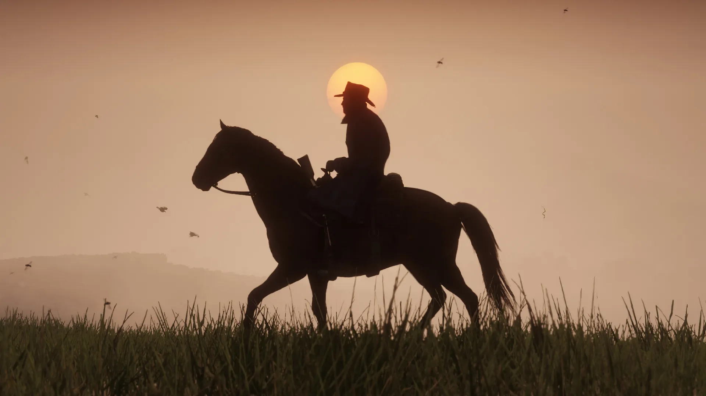

## 2019 to Present - Production Coordinator: Dialogue

I work closely with Writers and Design Directors across all of Rockstar's active projects that involve creative text and dialogue. As a result I am very familiar with motion capture, voice over and implementation pipelines that deliver dialogue as well as how they are hooked-up in game. During my time there I've been the sole Dialogue Producer overseeing Grand Theft Auto Online's DLC packs releasing a minimum of 2 full packs a year at the time of writing. I am also involved heavily in the creation, streamlining and management of dialogue piplines for motion capture, voice over and ambient audio.

## Joining in 2018 - Games Tester

I first joined Rockstar North in Edinburgh as a Games Tester working in Quality Assurance. While on the team I was the contact lead for missions content on Grand Theft Online DLC content before making a shift to testing narrative content on both Read Dead Redemption 2 and Read Dead Redemption Online. My day-to-day included ccreating testing plans to fully evaluate the current state of a content's dialogue, writing and automating dialogue reports, and working closely with scripters and producers to close out and manage pipelines.

 

   

    <iframe frameborder="0" allowfullscreen="" src="https://www.youtube.com/embed/HVRzx17WHVk?autoplay=1&mute=1" title="Mark Tempini Showreel 2021" allow="accelerometer; autoplay; clipboard-write; encrypted-media; gyroscope; picture-in-picture" ></iframe>
  

