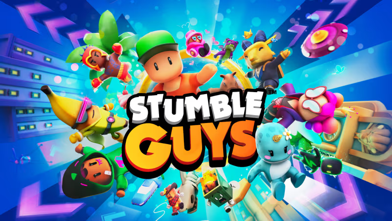
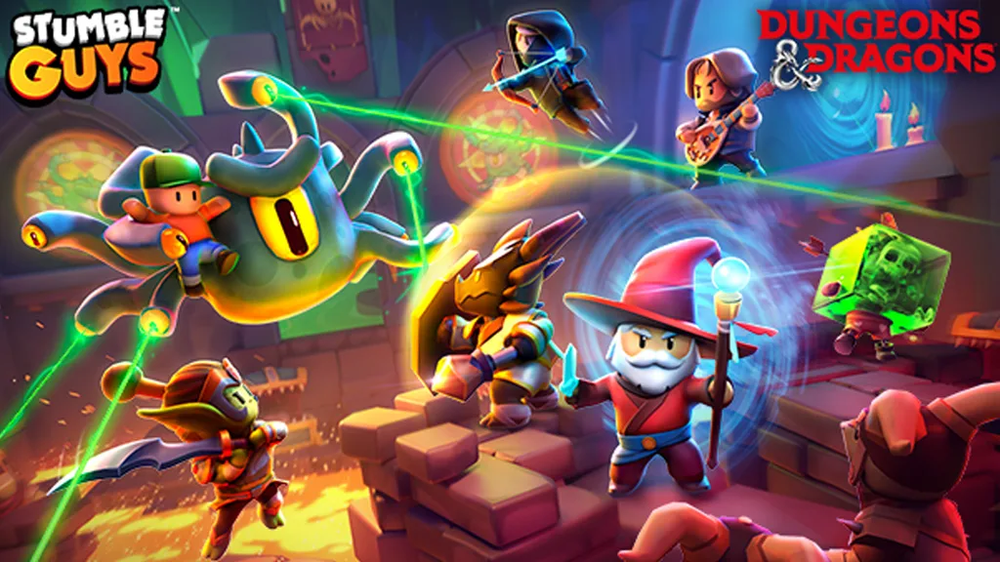

## 2023 to Present - Producer

The main project I've been a part of since joining has been Stumble Guys, the company's first live-service, real-time action game, and the first title released on all major consoles. My overall responsibilities have included overseeing various aspects of technical art, from developing bespoke level/art tooling to ensuring smooth cross-platform performance. I work closely with cross-functional teams, including design, engineering, and customer support, to ensure the timely delivery of high-quality content, as well as managing project timelines, resources, and key milestones.

### Tech Art, Tooling & Engineering Production

As a Technical Producer for the Tech Art/Tooling team, I managed both backend and front-end development, working across all levels of the project, from directors to individual contributors. My responsibilities included developing roadmaps that aligned with high-level project goals while ensuring that day-to-day production processes were streamlined. I focused on improving our technical production workflow, creating more efficient systems to enhance communication and collaboration between teams. This included optimizing the tool development pipeline and ensuring that both technical and non-technical stakeholders had clear visibility into progress and outcomes.

 

   

    <iframe frameborder="0" allowfullscreen="" src="https://www.youtube.com/embed/cWjgNxn243Q?si=vH66Ihp_R7QMY1Rw?autoplay=1&mute=1" title="StumbleGuysTrailer" allow="accelerometer; autoplay; clipboard-write; encrypted-media; gyroscope; picture-in-picture" ></iframe>
  

## LiveOps Production

At the start of July, I transitioned into the LiveOps team as the project required additional support. In my current role as a LiveOps Producer, I focus on revamping and introducing processes to improve clarity and minimize chaos within the team. My approach is people-centric, ensuring that individuals have the tools, support, and structure necessary to excel. By fostering clear communication and streamlining workflows, I help reduce bottlenecks and confusion, leading to smoother project execution. My work emphasizes operational efficiency while prioritizing team well-being, ensuring both the project's success and the empowerment of the people behind it. Drawing on my previous experience as a technical producer, I leverage my knowledge of tooling and development to provide robust support and solutions that enhance the LiveOps processes.

### Releases 
- Stumble Guys - Live Service Game.

