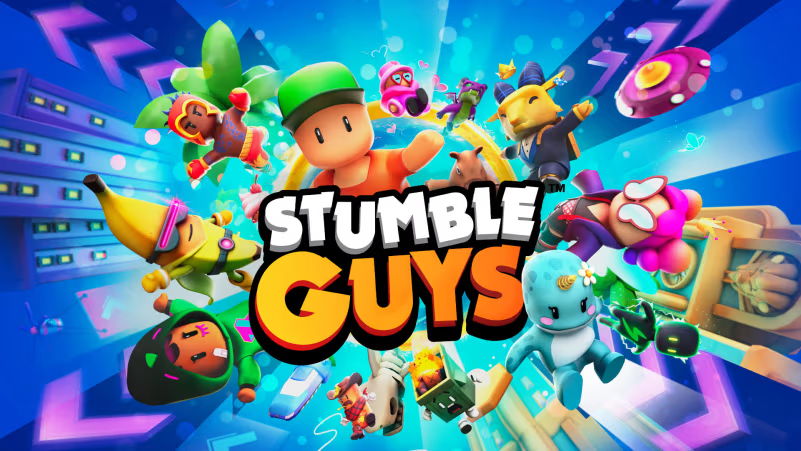
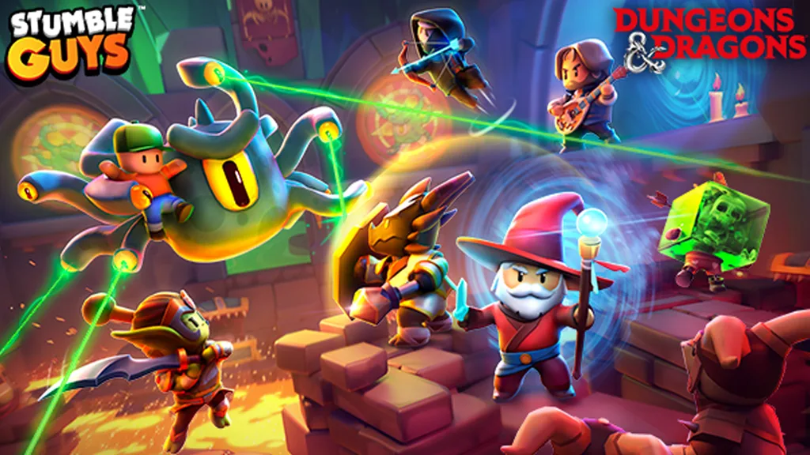

## Senior Producer (February 2025 - Present), Producer (August 2023 - February 2025) 

The primary project I’ve worked on at Scopely is Stumble Guys — the studio’s first live-service, real-time action game and its first title released across all major platforms, including console. My role has evolved alongside the project, spanning technical production, LiveOps, and performance-focused leadership within a large-scale live ecosystem.

Across this time, my core focus has been enabling teams to deliver high-quality content consistently: building clarity around priorities, improving production systems, and supporting a healthy live cadence for a game played by millions of players.

### Platform, Tooling & Technical Production

I initially joined the project as a Technical Producer, supporting Tech Art, Tooling, and Engineering teams responsible for the underlying systems that enable content creation and live delivery. I worked across backend and frontend development, partnering closely with directors, engineers, designers, and artists to translate high-level vision into actionable roadmaps and sustainable production plans.

My work centred on improving visibility, alignment, and throughput across teams — streamlining production workflows, refining tooling pipelines, and ensuring that both technical and non-technical stakeholders had shared understanding of progress, risks, and outcomes. This foundation work helped teams move faster without sacrificing stability or quality.

 

   

    <iframe frameborder="0" allowfullscreen="" src="https://www.youtube.com/embed/cWjgNxn243Q?si=vH66Ihp_R7QMY1Rw?autoplay=1&mute=1" title="StumbleGuysTrailer" allow="accelerometer; autoplay; clipboard-write; encrypted-media; gyroscope; picture-in-picture" ></iframe>
  

## Live Operations & Performance Leadership

As the needs of the project evolved, I transitioned into LiveOps and later into a broader Performance-focused production role, leading work across Analytics, Economy, LiveOps, and Monetization. In this capacity, I operate at the intersection of development, publishing, and live operations — ensuring that insights, systems, and delivery plans align to support both player experience and long-term ecosystem health.

A key part of this role has been introducing clearer structures and longer planning horizons into LiveOps, reducing reactive workflows and improving release confidence. By improving pipelines, tooling, and cross-team communication, we extended planning lead times, reduced incidents post-release, and created space for teams to iterate more deliberately. Throughout, my approach has remained people-first: focusing on clarity, trust, and sustainable pace rather than short-term fire-fighting.

### Releases 
- Stumble Guys - Live Service Game.

