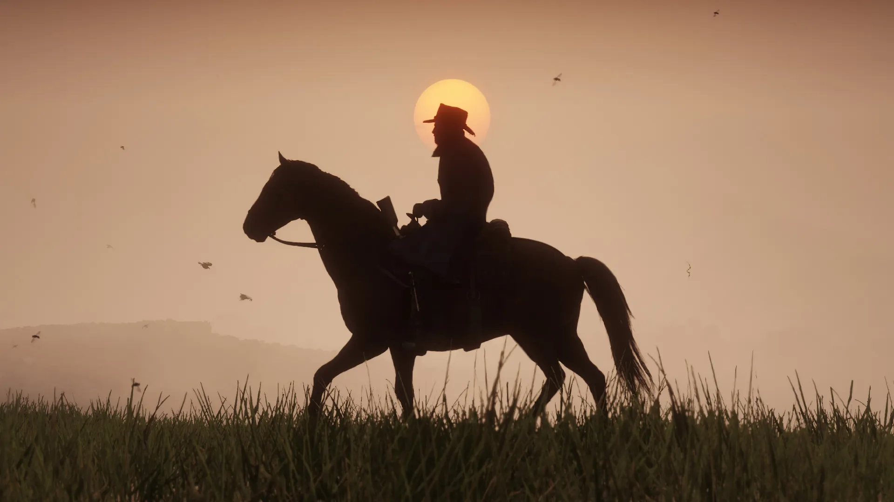

## 2022 to 2023 - Senior Production Coordinator: Online & Ped Writer

As a Senior Production Coordinator within Rockstar’s writing department, I owned large-scale dialogue production across online projects while maintaining oversight of multiple active narrative pipelines, including work on GTA VI. I was responsible for designing, managing, and evolving dialogue pipelines that interfaced closely with Design, Audio, Animation, Engineering, and Art teams.

Alongside my production responsibilities, I also contributed directly as a Ped Writer, authoring ambient world dialogue to bring depth and authenticity to Rockstar’s open worlds. This role sat at the intersection of creative authorship and technical systems, with dialogue implemented through complex, code-driven ambient frameworks that required close coordination across disciplines.

## 2019 to 2022 - Production Coordinator: Dialogue 

During my time as Production Coordinator, I served as the sole Dialogue Producer for Grand Theft Auto Online, overseeing dialogue delivery for a minimum of two major DLC packs per year, from planning through implementation and release. I worked closely with Writers and Design Directors across all of Rockstar's active projects that involved creative text and dialogue. As a result I am very familiar with motion capture, voice over and implementation pipelines that deliver dialogue as well as how they are hooked-up in game.  I am also involved heavily in the creation, streamlining and management of dialogue pipelines for motion capture, voice over and ambient audio.

 

   

    <iframe frameborder="0" allowfullscreen="" src="https://www.youtube.com/embed/aLUGHQq2aek?autoplay=1&mute=1" title="Mark Tempini Showreel 2021" allow="accelerometer; autoplay; clipboard-write; encrypted-media; gyroscope; picture-in-picture" ></iframe>
  

## Joining in 2018 - Games Tester

I first joined Rockstar North in Edinburgh as a Games Tester working in Quality Assurance. While on the team I was the contact lead for missions content on Grand Theft Online DLC content before making a shift to testing narrative content on both Read Dead Redemption 2 and Read Dead Redemption Online. My day-to-day included creating testing plans to fully evaluate the current state of a content's dialogue, writing and automating dialogue reports, and working closely with scripters and producers to close out and manage pipelines. This role laid the foundation for my later production work, giving me a strong grounding in content validation, pipeline health, and cross-discipline collaboration.

### Releases/Projects 
**Below is a selection of major releases I contributed to across production, dialogue, and pipeline ownership roles.**
- Grand Theft Auto 6 - In Development 
- Grand Theft Auto V - PS5 and Xbox Series X/S (2022)
- GTA Online: The Contract (2021)
- GTA Online: Los Santos Tuners (2021)
- Read Dead Online: Blood Money (2021)
- GTA Online: Cayo Perico Heist (2020)
- Read Dead Online: Bounty Hunter (2020)
- Read Dead Online: Naturalist (2020)
- GTA Online: Los Santos Summer Special (2020)
- GTA Online: Gerald's Last Play (2020)
- GTA Online: Open Wheel Races (2020)
- Read Dead Online: Moonshiners (2019)
- Read Dead Online: Legendary Bounties (2019)
- GTA Online: The Diamond Casino Heist (2019)
- Read Dead Online: Frontier Pursuits (2019)
- GTA Online: Diamond Casino & Resort (2019)
- Read Dead Redemption Online (2019)
- Read Dead Redemption 2 (2018)
- GTA Online: Arena War (2018)
- GTA Online: After Hours (2018)
- GTA Online Southern San Andreas Super Sport Series (2018)

 

   

    <iframe frameborder="0" allowfullscreen="" src="https://www.youtube.com/embed/HVRzx17WHVk?autoplay=1&mute=1" title="Mark Tempini Showreel 2021" allow="accelerometer; autoplay; clipboard-write; encrypted-media; gyroscope; picture-in-picture" ></iframe>
  

