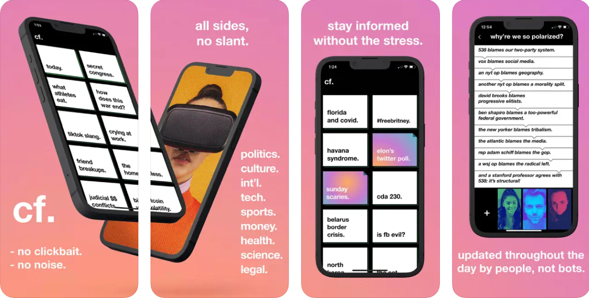
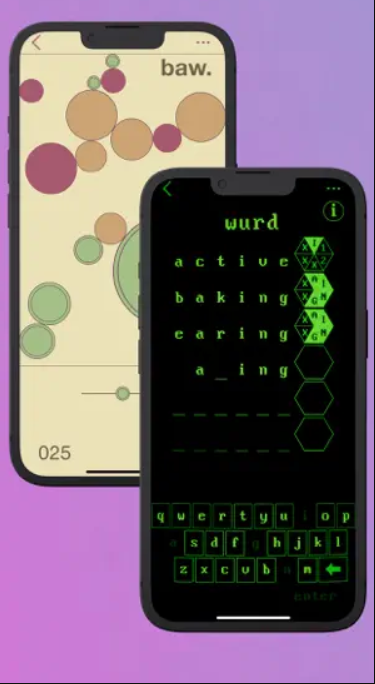

### About

[cf.me](https://cf.me) is a news app that's goal is to show both sides to every story but taking multiple sources and summarizing them in one place. My role in its development was to work on two small hyper-casual games that would launch embedded as part of the app.

### Baw

Baw was the first game developed for the app. The goal is to score as many points as possible. To do this the player must fire small balls into the play space which expand until colliding with another surface. Hitting this ball with subsequent shots lowers the health and pops it. When the ball pops it damages other nearby balls adding to a multiplier if they are also destroyed. The game was aimed at commuters to and from work which meant that we wanted a game that someone could easily pick up and play but had enough strategic depth to bring players back. I worked on this as a Designer, Motion Graphics Artist/Animator as well as Audio Designer due to the small team.

### Wurd

[Wurd](https://cf.me/wurd/index.html) is a word puzzle game. The game is a spin on Wordle taking inspiration from 1980s CRT text adventure games asking players to guess a six letter word and giving various clues as to how close they are based on the hexagonal icon next to the guess. I was also the primary artist on this project and due to my lack of development experience we went for a retro style that would suit the strengths of the team.

### Responsibilities

My responsibilities on the projects included:
- Designing core gameplay loops and scoring models
- VFX and Motion Graphics Design
- Audio design for Baw
- Previsualization for the look and feel of the game
- Market research and detailed analysis of competitor to present to the client
- UI design

The work I did on the project was super varied but at the heart I was a Designer that worked on the look and feel of the game. The team only had very limited access to a UI artist and I ended up doubling up on the work to help out where possible meaning I gained an incredible amount of experience in rapidly creating visual mockups in software like After Effects.

