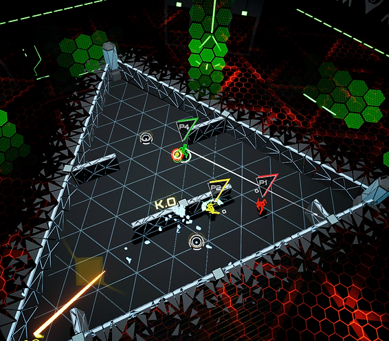

<video width="320" height="240" controls>
  <source src="ReboundTrailer.mp4" type="video/mp4">
</video>

### About

[Rebound](https://store.steampowered.com/app/1057560/Rebound_Dodgeball_Evolved/) is a Sci-Fi dodge-ball game that was made by myself and small team while at University for Dare to be Digital in 2016. The game is a 1-4 player top down arcade game with rotating levels and mutators that keep each rough fresh. During it's development I was the sole designer on the team but also branched out into production, writing and implementation. The game was selected as the first place winner of Dare to be Digital and was nominated for a BAFTA as a result.

### Responsibilites

My responsibilities on the project included:
- Designed the core functionality and systems of the gameplay as well as balancing the modes.
- Designed and implemented all levels within the game 
- Designed UI/UX for the game.
- Wrote and directed all voice lines.

Due to the small team there was enormous value in being able to jump in and lend a hand wherever required. This meant I acted as a generalist for a large part of the project but also was in charge of the overall vision of for the project and making sure that all team members goals aligned.

