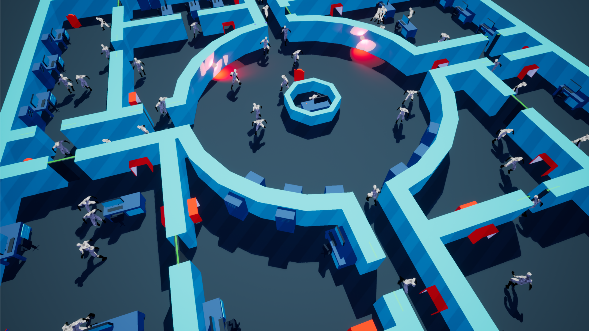

## The Thingy

**Role:** Generalist Designer & Artist

**Release:** Windows​

**Team Size:** Game Jam Team of 4

The Thingy is a Two player head-to-head competitive game in which player one controls the guard and is tasked with hunting down and eliminating player two; An intelligent parasite which transmits itself from host to host in an attempt to escape the research lab.

###Responsibilities

- Gameplay design for both characters including weapon design and balancing.
- Designing the narrative behind gameplay
- Creating the base level and map balancing
- VFX creation and VFX programming eg. blood splatters and fire.
- Some basic level scripting for environmental elements such as doors, key codes and lighting.

 **[Download Game](https://hexterion.itch.io/the-thingy-)** 

- Winner of Best Design Global Game Jam 2018 Glasgow 
- Winner of the Community Choice Awards 2018 Glasgow

## ColourGravWave

**Role:** Designer

**Release:** Unreleased

**Team Size:** Game Jam Team of 5

ColourGravWave is a single player time-trial game focused on rapid movement. The player must collect all the boxes as quickly as possible by changing the coloured platfoms that push (red) and pull (blue). The game was developed as part of the Global Game Jam and won best design and best art.

 

   

    <iframe frameborder="0" allowfullscreen="" src="https://www.youtube.com/embed/T6pKSMEk_Nc?autoplay=1&mute=1" title="ColourGravWave Demo" allow="accelerometer; autoplay; clipboard-write; encrypted-media; gyroscope; picture-in-picture" ></iframe>
  

###Responsibilities

- Gameplay design and systems design
- Designing and implementing the level.
- Audio design
- Production and team management.

 **[Download Game](http://globalgamejam.org/2017/games/grav-colour-wave)** 

- Winner of Best Design Global Game Jam 2017 Glasgow 
- Winner of the Community Choice Awards 2017 Glasgow