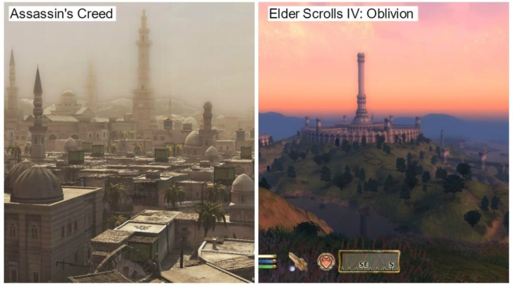

## Lorem ipsum dolor sit amet consectetur adipisicing elit

Lorem ipsum dolor sit amet consectetur adipisicing elit. Unde reprehenderit inventore sunt, consequatur omnis tempore ullam natus, porro odit aut, atque asperiores repudiandae corporis quidem esse eos provident velit perferendis magni fugit eum quisquam eligendi. Atque distinctio iure aliquam veniam inventore, soluta est, cum accusantium possimus illum quasi eveniet sed amet ipsa culpa vel in delectus laboriosam repellendus totam. Facere.


Aliquam aliquid rem facere dolorum consectetur consequatur distinctio [mollitia id modi repellendus](https://github.com/RyanFitzgerald/devfolio) vero quae dolorem commodi soluta voluptates iusto nobis est dolore provident, porro veritatis placeat nemo impedit! Asperiores culpa delectus hic qui saepe, ipsum quia, exercitationem repellendus magni soluta sit suscipit laborum ducimus.

## Asperiores culpa delectus hic qui saepe

### Facere labore velit ad autem

Vitae veritatis quae eius quis vel soluta cumque? Facere labore velit ad autem. Nisi recusandae ducimus molestiae error ipsa quaerat, dignissimos suscipit similique itaque sunt provident quasi minus ut porro. Optio modi harum _dolore necessitatibus exercitationem_ blanditiis magni error ipsum, odit deleniti eligendi facilis, nesciunt delectus sit nostrum porro quam accusamus excepturi labore sequi maiores soluta?

### Porro veritatis placeat nemo impedit

Veritatis et praesentium totam neque earum commodi nesciunt dolor quibusdam incidunt non, ex dicta molestias omnis maiores, maxime velit perferendis tenetur aut porro nostrum, suscipit soluta necessitatibus deserunt nobis. Minus rem dicta eos exercitationem illum consequatur consectetur praesentium voluptas. Dolor inventore quasi necessitatibus odio eaque doloribus.

> Repudiandae iusto et iure pariatur aliquid, quisquam, non sed culpa, dignissimos recusandae facilis. Debitis hic, quaerat recusandae ad id, quis nisi perspiciatis quo aliquid natus similique.

Illum esse recusandae facere ipsam fugiat est eaque ducimus facilis provident, distinctio cum aut corporis officiis quo fugit, similique temporibus inventore quidem tempora commodi saepe dicta! Numquam fugiat quibusdam aut ut, voluptatibus accusamus **repellendus quas minus consequuntur** possimus! Est eaque nesciunt, reiciendis voluptate placeat aspernatur doloremque unde cum et architecto suscipit quam facere corrupti nihil odit eum minima voluptatem nobis.

## Voluptatibus accusamus repellendus quas minus

Ipsum quod, ut animi mollitia ipsam repellat, dolore voluptate quibusdam quasi reiciendis necessitatibus odio ea nostrum illo explicabo? Ducimus, in repudiandae. Ratione dolore sequi in animi obcaecati incidunt reprehenderit illo repellat atque aperiam, praesentium eligendi! Sed voluptas voluptatem sunt distinctio pariatur ullam? Laudantium laboriosam.

- Numquam fugiat quibusdam aut ut
- Soluta necessitatibus deserunt nobis
- Illum esse recusandae facere ipsam

Lorem ipsum dolor sit amet consectetur adipisicing elit. Unde reprehenderit inventore sunt, consequatur omnis tempore ullam natus.

1. Numquam fugiat quibusdam aut ut
2. Soluta necessitatibus deserunt nobis
3. Illum esse recusandae facere ipsam

Lorem ipsum dolor sit amet consectetur adipisicing elit. Unde reprehenderit inventore sunt, consequatur omnis tempore ullam natus, porro odit aut, atque asperiores repudiandae corporis quidem esse eos provident velit perferendis magni fugit eum quisquam eligendi. Atque distinctio iure aliquam veniam inventore, soluta est, cum accusantium possimus illum quasi eveniet sed amet ipsa culpa vel in delectus laboriosam repellendus totam. Facere.

## Suscipit soluta necessitatibus deserunt nobi

Minus rem dicta eos exercitationem illum consequatur consectetur praesentium voluptas. Dolor inventore quasi necessitatibus odio eaque doloribus.

```js
const helloWorld = (name = 'World') => {
  return `Hello ${name}!`;
};

helloWorld();
helloWorld('John Doe');
```

Numquam fugiat quibusdam aut ut, voluptatibus accusamus repellendus quas minus consequuntur possimus!


### Abstract
Research has demonstrated the difficulty in achieving a balance with User Interfaces(UI) in games. Almost all large, nonlinear levels rely on UI practices outside level design in order to guide players. The use of nondiegetic UI can lower player immersion and the use of diegetic navigational UI is extremely difficult to design well. Few attempts have been made to design a large open world level that can be easily navigated without the use of some form of navigational UI, since research shows that the absence of UI can create a much better play experience. Many developers of linear single player games have begun to use embedded techniques, ranging from lighting and colour to motion and audio,to guide players through levels. However, these attempts have not been made in large nonlinear games.
 
This article explores the reliance of navigational UI in large nonlinear 3D levels by creating a 3D level using techniques such as light, colour and architecture to guide players along an ideal path. By using an iterative development cycle with high amounts of internal testing throughout development, multiple navigational techniques were implemented. The level was tested for its effectiveness in guiding players at separate stages in development and updated based on the results before a final evaluation.
 
Results evidenced that players can be guided through large nonlinear levels as the designer intended without any UI and indicated that play style influenced how users move through spaces.

## Keywords
Level design; world design; development cycles; navigation; user interface

### The Industry Today
Level Design is a complex area in games as it incorporates a vast amount of processes such as composition, lighting, colour, architecture, and audio to guide the player and their experience (Piaskiewicz, 2016).Nuernberger (2009) states that there is no list to go through when designing a level, as a complete combination of these techniques must be exploited to achieve a fulfilling gaming experience. Pagan (2001) believes that the key is to make levels believable using established design principles such as light and architecture. As he elaborates, skilful planning is the key to forming a level that directs attention using subtle clues. Importantly,Pagannever argues that the design should explicitly tell the player where to go, but rather he encourages using design techniques as cues to guide the player.

### The Problem
Despite all the techniques used by professionals, games often have some sort of navigational UI asa safety net. Navigation UI is the standard in large nonlinear levels for most games.Players generally indicate that they are happy with superimposed UI if it supplies relative information;others state they need it to navigate. Although diegetic UI is more aesthetically pleasing and,if done right,can guide the player without the need of nondiegetic UI (Llanos & Jørgensen, 2011), the problem with diegetic UI is the difficulty in making it work well. Many developers choose to fall back on simpler traditional UI as it is easier to design. Chittaro and Scagnetto (2001) believe that the most efficient way of providing navigational support is through the use of maps and other UI functionality. However, Nerurkar (2016) believes that maps and navigational markers are separate from level design and are not needed. In fact, non diegetic UI can lessen the player’s sense of immersion as it creates an additional layer that further separates them from the game(Breda, 2008; Iacovides et al. 2015; Wilson, 2006). Iacovides et al.(2015) researched the effect the Heads-UpDisplay (HUD) had on immersion in the first-person shooter(FPS) Battlefield 3 (EA DICE, 2011). Although the game’s UI is all relevant information,such as displaying ammo count, identifying friendly teammates and directing the player to the next objective, the study suggested that without any UI features the players had a more enjoyable experience.

### Literature Review
Deliberately designing and implementing subtle environmental navigational techniques such as lighting, colour, architecture, semiotics, and affordances could be a solution to the issues with navigational UI in large open levels.

## Affordances & Semiotics
Affordance is the theory of objects having both actual properties and perceived properties (Norman, 1988). Norman (1999) describes affordance as a relationship between the object and the individual that is acting on the object. Semiotics, on the other hand, is the study of meaning and more specifically to what signs represent and how their context shapes interpretation (Lindley, 2005; Salen & Zimmerman, 2003). When it comes to game design, these two theories are both used in similar ways. Designers suggest a possible usage of objects in the context of the game world and the player will often play along. The context of any game needs to be taken into consideration when designing a level as players will expect and perceive objects to have meaning. These expectations are derived, in part, from the game’s genre. In an FPS, the player may expect to have different guns and the ability to kill enemies. Players often assume affordances based on the genre of the game that is presented to them (Gilnert, 2008). The context of the game also dictates how a user will interpret the use of an object. Affordances can lend themselves to creating meaningful interactions with the users. Mark Brown (2016) states that affordances can be used as an environmental navigation tool to guide players. Using affordance as a technique to drive players through a level can have its merits and is also a very effective form of subtle navigation. However, properly communicating the perceived and actual meaning of objects is required to properly guide the players — semiotics is how we interpret signs and the symbol structures they allude to (Mäyrä, 2006). Both affordances and semiotics can be used to shape the way players interpret the use and meaning of the game’s architectural space.

## Architecture & Composition
Architecture is perhaps the most established technique used within level design, as it combines physics and mathematics with art and aesthetics. Tsoupikova (2006) believes that the aesthetics of virtual worlds are directly related to the immersion and overall emotional experience the user has. In open-world and large levels the designer must consider ways of guiding the player in a consistent manner. In TheElder Scrolls IV: Oblivion (Bethesda Softworks, 2006) the imperial city is at the centre of the map and is marked with a huge tower that can be seen from vast distances (Figure 1). This is an example of using an architectural landmark so the player knows where they are in relation to the centre of the map.


_Figure 1. Landmark Examples in open world games._

Abrams (2010) describes wayfinding as both how a person orients themselves and experiences an environment. Both are important factors in how the environment is communicated to the user. Without clarity, the possibility of wayfinding is near nonexistent (Abrams, 2010; Dogu & Erkip, 2000). Using landmarks or reference points, the user can interpret where they are in the world, where they have been, and make conscious or subconscious decisions on where to go next.

De Jong (2008) discusses the importance of composition in games. He expands by contrasting how the composition of lines can make or break the feel of the environment—vertical lines emphasise height via optical illusions and horizontal lines can help move the player. By using compositions to frame objectives in 3D environments, as seen in games such as Dishonored (Arkane Studios, 2012), the designer can use the environment to frame important areas such as the player’s objective (Solarski, 2013) (Figure 2).


_Figure 2. Dishonored framing the objective._

Landmarks and careful compositional placement help facilitate the use of colour and especially lighting to fully immerse and subtly guide the player through an environment

## Lighting
El-Nasr et al. (2009) argue that lighting is a vital tool for ensuring visibility, establishing the mood, and directing the participant’s attention to important elements in a scene. She notes that this is the case for traditional media such as film; however, for games it is trickier to get right as they are an interactive medium and far less documented. Game environments are dynamic and unpredictable due to the freedom players have in the game world, meaning light is used as much for directing the player’s attention as it is for storytelling (El-Nasr et al., 2006).

Lighting is most commonly used in games to grab the player’s attention and set the mood of the game (Jacobsson & Gomez, 2004; Winn et al., 2011). For example, a flashing light in a largely static environment is likely to draw the player’s eye. The way light establishes the mood, along with its context, often influences how the player will interpret and interact with the game. For example, Wadstein (2013) suggests that in a horror game a player would be more inclined to take the route that is well illuminated. The context in which designers use light is generally tied to the game mechanics and genre. In stealth games, such as Thief (Square Enix, 2014) players are more inclined to take the darker routes as the light may reveal the player and put them in danger

## Colour
Colour, like lighting, is an effective way of establishing the mood and portraying emotion in media (Tulleken, 2015). The colour of an environment can drive home the atmosphere a game is attempting to portray. Muted colours and distorted objects may foster an unsettling mood, whereas drab and realistic objects might convey a sense of gritty realism (Dickey, 2005). Colour in games can also create an unspoken language between the user and the game. By establishing the meaning of a certain colour, the user can then relate it to a function in the game (Anhut, 2014; Brown, 2016). For example, Left 4 Dead 2 (Valve Corporation, 2009) uses a muted colour palette but establishes the colour red to mean safety, with red safe room doors and med kits. The game establishes that red is positive, which encourages the player to look for that colour. People have natural preferences in the real world (Simmons, 2011), however, if designers establish a meaning for specific colours early on in a game the player will offer it an affordance. An article by Palmer & Schloss (2010), found that people prefer colours with strong connections to what they like and dislike. This finding can be useful for game design, as designers can establish that a specific colour is beneficial to the player in the game world, thereby encouraging players to react positively to its presence in that world. The mood is also an important aspect for influencing how the player will act within the game world. Setting the mood could be done using different hues or screen tints to give a level a specific feel, which can thereby shape its context.

## Conclusion
When it comes to integrating the previous techniques into a level, they all, with varying degrees of effectiveness, guide the player indirectly. However, no single technique is enough on its own. Designers must use a combination of all the mentioned techniques (plus others I have not discussed) to effectively guide the players (Brown 2016; De Jong, 2008; Nuernberger, 2009; Piaskiewicz, 2016). There are many techniques, such as motion and audio, which are less documented in terms of navigation, but are also vital components of a video game. A bird flying down a path or a gunshot in the distance will direct a player just as effectively when used in combination with the aforementioned techniques.

### Methods
The aim of this project was to investigate whether the use of embedded navigational techniques as an alternative to traditional UI in large 3D nonlinear levels are sufficient to guide a player. The project used the develop and test method, which focuses on developing an artefact (such as a level) that can potentially solve an existing issue, then evaluate its strengths and weaknesses in solving the problem (Oates, 2006). Unreal Engine 4 was chosen for development, based on its graphical capabilities and my previous experience with it. Its level design tools are also intuitive, which helped the overall workflow of the project.

## Iterative Level Design
The project’s lifecycle is based on Iterative Design Development which is a widespread method used throughout the game industry (Luton, 2009). The lifecycle is an adaptation of the agile lifecycle which focuses on short iterations and continuous testing throughout development (Highsmith & Cockburn, 2001). Games are well suited to the iterative nature of this development lifecycle as prototypes are available very early on and can be built upon throughout the development. Iterating throughout development is vital for level design, as the quality of the final output will be drastically reduced without continuous refinements based on internal and external testing.

### Planning the Design
Distinguishing the theme and how techniques will be used in the requirement stage allows for the design to begin on a solid foundation. To create a level close to what would be in a released game, an analysis of AAA games with large open levels or worlds was conducted. Below (Table 1) the results of the analysis are presented. The games chosen primarily follow a single humanoid character; therefore, Massively Multiplayer Online Role-Playing Games (MMORPGs), open sandbox games, nonlinear driving games and games that take place in space were not listed. The games and franchises chosen were also under the restriction of having at least one release within the past 5 years or have maintained a large player base, meaning they had to be relevant to modern practices.

| Total Games                                                  	    | Main Environmental Aspect 	|
|-------------------------------------------------------------------|---------------------------	|
| 37 Games/Franchises <br> (Franchises had between 2 and 9+ games) 	| Forest/Nature - 18        	|
|                                                              	    | Urban – 15                	|
|                                                              	    | Other - 4                 	|
_Table 1. Totals of the analysed games. Note: Franchises are counted as 1 instance_

Following the analysis, the overall aesthetic chosen was a forested area with a small urban settlement. Moodboards, which allow a coherent visual style during development, were the next step in the requirements stage. The use of moodboards helped establish the basics of colour palettes, layout, and lighting methods which create a vision of the end product and how the navigational techniques will be embedded within the level. This led to the use of an initial moodboard (Figure 3) to gain a better understanding of the layout of forest environments and provide a base for future moodboards that would target areas like lighting and tree types.


_Figure 3. Layout moodboard._

Following a literature review and market review of current game environments, a large amount of techniques were narrowed down and planned according to the demands of the level’s aesthetics. Establishing a theme allowed for a high-level overview of the techniques and how they would be used within the given context. The following table (Table 2) summarises the techniques and their envisioned usage in the design and implementation stage.

| Technique    |   | Usage                                                                                                                                            |
|--------------|---|--------------------------------------------------------------------------------------------------------------------------------------------------|
| Light        |   | Dense vegetation and natural sunlight breaking through trees to grab player attention. Lanterns or small fires in urban and camping areas.       |
| Colour       |   | Repeating colour—white on a green forest background. Contrasting textures of paths and ground to lead player                                     |
| Architecture |   | Environmental landmasses to direct player attention through landmarks such as mountains. Framing objectives and blocking geometry using foliage. |
| Affordances  |   | Bridges, fire, and doors being slightly open.                                                                                                    |
| Semiotics    |   | Campfires at the start signify safety, large forest fire to show danger.                                                                         |
| Motion       |   | Animals, wind, and water streams                                                                                                                 |
| Audio        |   | Birds chirping, wind blowing, waterfall roar, and the crackling of fire.   
_Table 2. Techniques in conjunction with the aesthetics._

## Design and the Iterative Process
The designs were iterated upon throughout development and revisited based on changes in the implementation. During development there were a series of milestones: paper prototypes, grey boxing, asset introduction, and polish. Each of these milestones had their own iteration cycles, with internal testing steering the direction and changes. Following the completion of the final milestone came two rounds of external testing which introduced some systemic and design changes before further external testing. The techniques that were discussed in the previous section were expanded and were the main focus when it came to each area of the milestones. In the paper prototype stage, the focus was to plan the landscape and flow of the land by designing large landscape features such as mountains and rivers, as well as how these features would guide the player. These features were then translated to the engine in the grey boxing stage by sculpting the landscape from a flat plain and blocking out the urban structure.

The next phase of implementation was split into two parts: painting the landscape and adding the foliage and urban assets. The most important part of the painting process was the creation of the paths throughout the level; these were modified and polished throughout the development cycle. The second part was a large-scale foliage implementation which involved a combination of hand-placed objects and procedural placement based on player location to increase optimisation.

Introducing the navigational techniques was the most iterated part of the development. Figure 4 displays the implementation of the techniques. The top left of the image shows the player starting zone, which was designed to orient the player towards the mountain, complemented by the natural slope of the path which leads the player towards said landmark. The player is also surrounded by white logs in order to establish that these signify safety, such as the shelter of the camp the player begins in. This is due to findings that repeating colour is an extremely effective tool in guiding players.

The top right image displays the use of natural lighting to illuminate the desired paths for the user to take, as there is a slight fork in the path to the right that leads to a much darker, smaller path. Creating the light was achieved using directional light that was then attached to a skybox; meaning the height of the sun was a result of the rotation of the directional light.

The bottom left image shows the use of the mountain as a key landmark and the use of repeating lamps to guide the players. Finally, the bottom right image shows birds. These birds fly down the path on the players approach, intended to create motion and direct the players vision down the path.


_Figure 4. Selection of implemented techniques_

Figure 5 displays further implemented techniques that were used to guide players. The top left image shows the use of fire to repel players from the area through affordances. This was achieved by using the standard tree models with the inclusion of fire and smoke particle effects with the addition of a fog screen to attempt to push players away. The top right image shows the use of motion and audio in the waterfall with the repeating colour—white—in the log bridge. The colour white is further emphasised in the bottom right image showing both a log and white steps leading towards a bridge in the urban area. Mark Brown (2016) highlights the use of repeated colour in the environment as a way of signalling to the players which way to go. The bridges were also intended to be crossed through affordance, as both had a different point of interest on the other side in order to entice the player to cross. Finally, the image in the bottom left shows the use of colour and light to draw players towards the final house. This was a change implemented due to results from the expert review which will be discussed in the following section.


_Figure 5. Further implemented techniques._

The primary method of internal testing was an analytical evaluation. This meant that there was no need for user involvement throughout the implementation stage due to the amount of time needed to briefly evaluate the state of the level. The techniques were often judged on visibility and the contrast to the environment that surrounds them. Although these evaluations were largely a result of the author’s judgement, minor comparisons were drawn to the existing techniques used in games that were discussed in the literature review.

### Results
To provide a thorough analysis and evaluation of the level’s success, various data gathering techniques were utilised to analyse the usability of the level. The usability in the context of the project was an evaluation of the player’s ability to navigate through the level along the desired route. Usability is a structured method which is focused on specific parts of the overall level. Small amounts of usability testing were done throughout development, especially in the design phase, however, this was done solely by the author while the later tests were undertaken using participants that are familiar with games.

Testing the level was focused on the evaluation of the navigational successes, misunderstandings, and overall effectiveness of the techniques. In order to analyse these tests, a series of different methods were employed during the testing phase to gain a comprehensive set of results. The main aspect was tracking player movement to make comparisons between multiple users and the routes they take through the level, and then compare this alongside the desired path. Observations were also made, as part of think-aloud protocol, to gain immediate feedback to iterate upon and determine if players were interacting with the level as designed. Based on the observations and notes made, a short semi-structured interview was conducted with the participants. All the methods used were part of determining the outcome of the following hypothesis:

>Players will be able to efficiently navigate the large nonlinear level from start to finish via environmental navigational techniques that are subtly built into the level.

The results gathered were split into two different sections: (1) the heatmap generated from all the participants’ routes through the level and (2) the combined results of the observations and interviews. These were both used in an expert review to iterate on the existing level before the final playtest.

The participants that took part in the first playtest were familiar with some aspects of the design stages and had been consulted on minor choices throughout. Each participant was contacted personally and requested to participate in a playtest that would involve playing a level and answering a short interview. The participants in the larger final playtest all had gaming experience, although this varied from casual mobile gamers to hardcore competitive gamers. These categories were self-identified by the participants during the interview that followed. The participants also varied as some had played the level before. However, since no one had previously discovered the end point, the author asked the same individuals to play again to see if there was a noticeable improvement.

## Expert Review
The heatmaps tracked the player’s path through the level and were aligned against the author's intended path. For the majority of participants, the routes taken were relatively similar without much deviation from the intended route. No player found the end house during this stage— most lingered near the house but never went in—showing there was work needed on the urban environment before the final playtest. Notably, one participant (green in Figure 6) was extremely erratic in the route they took and they regularly strayed from the path in order to explore more open areas. Most notable about green’s route is that instead of crossing the river for a second time, they went left towards the top left of the level. The indication to cross the river was the use of birds and motion; however, green did not see these birds and therefore turned left and had no other indication of where to go. This further proved that a single navigational aid is not enough for such an interactive and complex medium.


_Figure 6. Expert review participant routes. Blue is the intended route._

| Questions                                                                     |   | Participants' answers                                                                                                                                                                                                                                                        |
|-------------------------------------------------------------------------------|---|------------------------------------------------------------------------------------------------------------------------------------------------------------------------------------------------------------------------------------------------------------------------------|
| Did you feel there was something missing from what you played?                |   | No player mentioned missing UI; however, several expressed a lack of interactivity and the world feeling empty.                                                                                                                                                              |
| How did the level feel to you in terms of linearity?                          |   | Half of participants said they felt the level was linear, and those that did not identified the scale as the reason. Green from figure 6 did not feel the level was linear at all. Those that did feel it was linear said it felt that there was only one correct way to go. |
| When playing, how did you proceed when you were unsure of the next objective? |   | Participants were split—they either followed the path or followed landmarks, such as the fire or the mountain and town. Those that followed the path were the ones who believed the level was most linear.                                                                   |


_Table 3. A selection of questions and answers addressing the level and its gameplay._

The participants were then asked personalised questions based on their experience and the author’s observations. This allowed the author to discover potential reasons behind player’s actions and that two main areas were not working as intended. The town, especially the end house, needed radical changes as the level had a 0% completion rate due to most users feeling lost by the time they arrived at the town. The other issue was the fire attracting players rather than pushing them away in the opposite direction. They also attributed various amounts of justification to their actions mentioning that they wandered off to gain higher ground, and that they were aware that they were being led by certain colours and props. Results show that many players felt the level was linear as they were not presented many options and directions along the main path despite the level being completely open.

## Moving Forward
As a result of the expert review, many design improvements were made on top of optimisation and systemic changes. The reason for the implementation changes was based on two parts of repeating feedback from the playtest. The first was the fire attracting people rather than pushing them away, which resulted in the implementation of the illusion of damage and a sharp audio cue to make participants believe that the fire was dangerous when approached. The fire itself was also made to look less appealing, adding a thick surrounding smoke as well as more fire and dead trees. A simple interaction system was also implemented as participants had exclaimed a noticeable lack of interaction. It offered some navigational value with storytelling elements, but the intention was to make the level more engaging.

The urban area was a key issue and underwent the most changes. Windows were blacked out and doors boarded up to make them seem as though they could not be interacted with. This was intended to make players search for a house that could be interacted with and make the end house stand out further. The end house had its colour changed to contrast with other houses. The house was also illuminated and had smoke from the chimney in order to signify that it was where the player should go. An interior for the house was also created, which can be seen below (Figure 7).


_Figure 7. Final house interior_

Finally, the aspect of linearity was addressed. As there were several new routes added, many of the dead ends were removed and larger points of interest such as castle ruins were added as landmarks and to make the world feel fuller. There were also minor changes to the bridges to make them more distinguishable from each other.

## Final Review
At first glance the heatmap looks just as varied as before. However, after closer analysis, participants that had played the level before were coloured yellow revealing that all of them had taken the same alternative route. It is also worth noting that the massive variations from the desired route, especially in the top right of figure 8, were all from one participant. There was a significant decrease in the amount of people attempting to explore the fire. Many did not try, and those that did were instantly turned away due to the audio feedback that played. The overall navigation in the urban area was also greatly improved. Players moved instinctively towards the end house as soon as they had seen it, which meant that routes were less varied within the town. With the addition of the boarded-up windows, players did not try to get in to other houses as much. However, they often exclaimed a desire to see if there was a house that was not boarded up.

